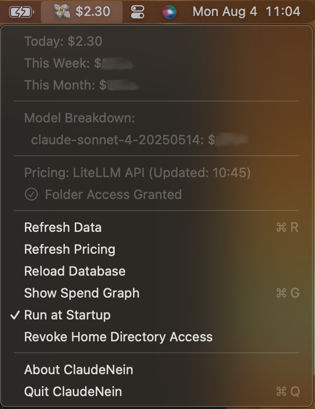

# Claude Nein - Claude Code Spend Monitor 

A native macOS menu bar application that monitors your Claude Code spending in real-time, providing intuitive visual feedback and detailed breakdowns. Inspired by [ccusage](https://github.com/ryoppippi/ccusage/).

 

## Overview

Claude Nein lives in your macOS menu bar, keeping you constantly updated on your Claude Code API usage costs. It automatically discovers your Claude project log files, parses them efficiently, and presents a clear summary of your spending.

## Installation

1. Visit the [Releases](https://github.com/forketyfork/claude-nein/releases) page and download the `ClaudeNein-<version>-unsigned.zip` asset from the latest release.
2. Unzip the archive and move `ClaudeNein.app` to your `/Applications` folder.
3. Reset the quarantine flag on the app: `xattr -d com.apple.quarantine /Applications/ClaudeNein.app`
4. Open the app. On first run, the app will ask you for access to the Claude directories.

## Features

- **Real-Time Menu Bar Display** – today's spend appears in the menu bar and animates smoothly when the value changes.
- **Detailed Spend Summaries** – the dropdown menu shows totals for today, this week and this month.
- **Model‑Specific Costs** – see which models account for the most spend.
- **Automatic & Efficient Monitoring** – uses FSEvents to watch Claude log files with minimal overhead.
- **Persistent Data Storage** – usage is cached locally in Core Data so data survives restarts.
- **Run at Startup Option** – enable automatic launch when you log in.
- **Database Management** – built in "Reload Database" command clears and reloads cached usage.
- **Spend Graphs** – interactive graph view showing spending trends by day, month, or year with navigation controls.
- **Secure & Private** – all processing happens on your Mac; the only network request fetches pricing information.
- **Claude Directory Access Control** – you explicitly grant and revoke access only to the Claude log directories.
- **Up‑to‑Date Pricing** – pricing data is pulled from LiteLLM with cached and bundled fallbacks, and the current data source is displayed in the menu.
- **Comprehensive Logging** – centralized logging system for debugging and monitoring app behavior.

## How It Works

1.  **Permissions** – on first launch you grant read‑only access to the `~/.claude` and `~/.config/claude` directories via a clear Yes/No dialog.
2.  **File Monitoring** – the app searches `~/.claude/projects` and `~/.config/claude/projects` for `.jsonl` logs and monitors them with FSEvents.
3.  **Parsing** – changed files are parsed and deduplicated, extracting model names, timestamps and token counts including cache tokens.
4.  **Data Storage**: Parsed usage entries are stored in a local Core Data database with intelligent deduplication to prevent duplicate entries.
5.  **Cost Calculation**: Using the latest pricing data, it calculates the cost for each entry and aggregates spending data from the database.
6.  **UI Update**: It displays the aggregated costs in the menu bar and detailed dropdown menu, with real-time updates as new data arrives.

## Running From Sources

1. Open `ClaudeNein.xcodeproj` in Xcode (15 or later).
2. Select the **ClaudeNein** scheme.
3. Build and run the project to launch the menu bar app.
4. To run the unit tests use `xcodebuild test -scheme ClaudeNein -destination 'platform=macOS'`.

## Technical Details

-   **Language**: Swift
-   **Framework**: SwiftUI for UI components, AppKit for menu bar integration
-   **Platform**: macOS (menu bar app)
-   **Data Storage**: Core Data for persistent local storage
-   **Architecture**: The app runs as a background agent (`NSStatusItem`) managed by a central `MenuBarManager` class. It uses:
    - `FileMonitor` for observing file system changes with FSEvents
    - `DataStore` for Core Data persistence and spend calculations
    - `PricingManager` for fetching and caching model pricing data
    - `HomeDirectoryAccessManager` for handling secure file access permissions

### Data Source

The app monitors Claude Code `.jsonl` files located in your Claude configuration directories, for example:

- `~/.claude/projects/`
- `~/.config/claude/projects/`

### Project Structure

The project is organized as follows:

```
ClaudeNein/
├── ClaudeNeinApp.swift              # Main app entry point with MenuBarManager
├── Models.swift                     # Data models (UsageEntry, SpendSummary, etc.)
├── DataStore.swift                  # Core Data persistence layer for usage entries
├── Model.xcdatamodeld/              # Core Data model definition
├── FileMonitor.swift                # Monitors the file system for log changes
├── HomeDirectoryAccessManager.swift # Handles permissions for home directory access
├── DirectoryAccessManager.swift     # Additional directory access management
├── SpendCalculator.swift            # Calculates spend totals and breakdowns
├── PricingManager.swift             # Fetches and manages model pricing data
├── JSONLParser.swift                # Parses `.jsonl` log files
├── LiteLLMParser.swift              # Parses pricing data from LiteLLM source
├── LaunchAtLoginManager.swift       # Manages launch at login functionality
├── SpendGraphView.swift             # SwiftUI view for spending graphs
├── Logger.swift                     # Centralized logging system
└── Assets.xcassets/                 # App icons and assets
```

## Privacy & Security

Claude Nein is designed with privacy as a priority:

-   **Local Processing**: All log file parsing and calculations happen on your Mac.
-   **Local Data Storage**: Usage data is stored locally in a Core Data database on your machine.
-   **No Data Transmission**: No usage data or personal information is ever sent to any external server.
-   **Limited Permissions**: The app only requests the read-only permissions necessary to access Claude's log files.
-   **Transparent Pricing Updates**: The only network request made is to the public LiteLLM GitHub repository to fetch `model_prices_and_context_window.json`.

## Contributing

Contributions are welcome! Please feel free to open an issue or submit a pull request.

## Disclaimer

This is an unofficial, third-party application and is not affiliated with, authorized, or endorsed by Anthropic. Use at your own risk.
